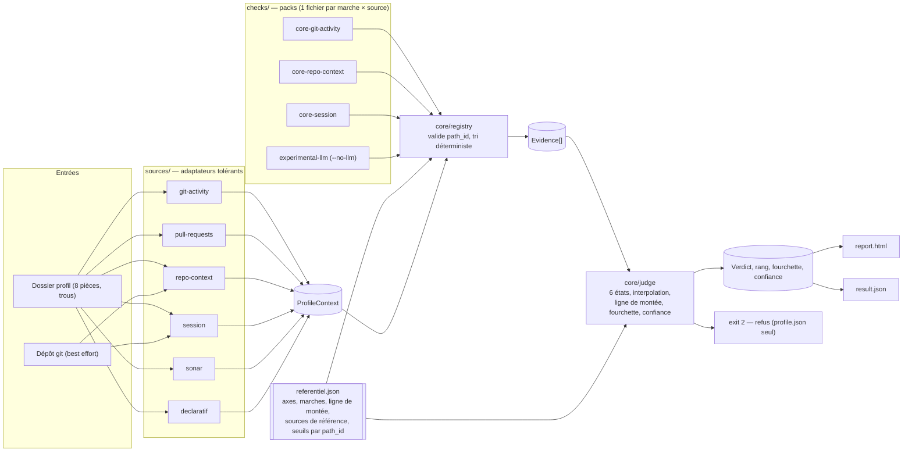

# INSTALL.md - `recognAIze`

Technical vision and installation guide.

> 🤖 Amendment (Part 7, 2026-08-29) : la Vision, les Decisions et le Stack
> summary ci-dessous datent du bootstrap (Part 1) et gardent volontairement
> leur ambition d'origine (audit trail). Ce qui est **réellement livré** dans
> ce run : le chemin déterministe seul — `cache/*.json`, `ANTHROPIC_API_KEY`,
> le pack `experimental-llm`, `git`/`gh` en mode dépôt réel n'existent pas
> dans le dépôt (Non-goals du spec, US-022/US-024/US-025). Le flag CLI
> `--no-llm` existe bien sur `analyze` mais reste sans effet observable
> (aucun enrichissement à désactiver). La section **Folder structure**
> plus bas est, elle, vérifiée mot pour mot contre le dépôt réel.

## Vision

Un profil de développeur entre ; son rang AI-Driven Development (White → Gold) sort, avec ce qui l'y a mené, ce dont on n'est pas sûr, et la prochaine marche.

CLI locale, offline-first, sans clé d'API requise : le chemin déterministe décide seul du rang, une fourchette et une confiance disent ce qu'on ne sait pas, un LLM optionnel enrichit. Le différenciateur n'est pas la finesse du référentiel mais l'honnêteté sur l'incertitude (fourchette, « ce qui manque pour trancher », ablation prouvée) et un moteur de vérification **modulaire** : chaque point de vérification est un module qu'on ajoute, retire ou modifie sans toucher à la logique globale des 5 axes.

## Decisions

| Decision           | Choice                                                   | Why                                                                                                   |
| ------------------ | -------------------------------------------------------- | ----------------------------------------------------------------------------------------------------- |
| Architecture       | Monolithe modulaire « B+ » : core générique + sources + packs de checks | Ajouter/retirer un check = un fichier ; le juge n'importe jamais un check ; référentiel JSON = source de vérité des seuils |
| Front-end          | HTML statique autonome généré (`report.html`, SVG inline, polices système) | Le jury ouvre en `file://` sans serveur ni CDN ; critère « on peut le reprendre »                    |
| Back-end           | CLI TypeScript / Node ≥ 20, `tsc` vers `dist/`, aucun binaire externe | Une personne, 60 h, stack maîtrisée ; « comment on lance » tient en deux lignes                       |
| Database           | Fichiers : `referentiel.json`, `result.json`, `cache/*.json`, `recognaize-cli-out/<sujet>/runs/` | Pas de charge, déterminisme, lisibilité, diff en revue                                                |
| Auth               | n/a (clé `ANTHROPIC_API_KEY` optionnelle en variable d'environnement) | Aucune clé requise ; jamais dans le dépôt ni l'historique                                              |
| Hosting            | n/a — dépôt GitHub public MIT                             | Livrable hackathon                                                                                    |

## Stack summary

- **Front-end:** HTML 5 + CSS + SVG inline générés par `src/report/html.ts`, contenu du profil échappé, ≤ 2 Mo
- **Back-end:** TypeScript 5.x, Node ≥ 20 (vérification au démarrage), ESM, `commander` (CLI), `zod` (schémas), `vitest` (tests + evals), ESLint `no-restricted-imports` (frontières de modules)
- **Database:** JSON sur disque ; `referentiel.json` validé par Zod au démarrage
- **Auth:** n/a
- **Hosting:** n/a
- **Key integrations:** `git` (mode dépôt, best effort) ; `gh` optionnel ; SDK `@anthropic-ai/sdk` optionnel (pack `experimental-llm`, Sonnet 5 par défaut, cache de rejeu)

## Architecture



Trois frontières : les **sources** ne connaissent que les fichiers d'entrée et produisent un `ProfileContext` typé (pièce illisible = absente + avertissement) ; les **checks** ne connaissent que `ProfileContext` + `referentiel` et produisent des `Evidence` (polarité, force, `path_id`) — un check désactivé rend ses chemins *inconnus*, jamais absents ; le **juge** ne connaît que `Evidence[]` + `referentiel` et n'importe jamais un check (règle ESLint). Le référentiel commence par les cellules de la grille officielle (pack `core`, baseline verte samedi midi) ; les marches fines sont des packs additionnels activés là où elles discriminent.

## Folder structure

> Arborescence réelle, vérifiée contre le dépôt (`git ls-files`) à la Part 7 —
> remplace la projection initiale de Part 1. Écarts notables face à la
> projection : pas de `src/llm/` ni `cache/` ni `sources/git-repo.ts` ni
> `scripts/cache-*` (enrichissement LLM, mode dépôt réel, cache de rejeu :
> hors périmètre, Non-goals US-022/US-024/US-025) ; la CLI n'expose que
> `analyze` et `checks` (`list`, `explain <marche>`) — `eval` est un script
> npm (`npm run eval`), jamais une sous-commande de `dist/cli.js`.

```
recognAIze/
├── src/
│   ├── cli.ts                        # analyze | checks list | checks explain <marche>
│   ├── analyze.ts                    # câblage bout en bout : sources → registry → judge → report
│   ├── referentiel.json              # axes, marches, ligne de montée, sources de référence par axe, seuils par path_id
│   ├── referentiel/concepts.json     # libellés + liens docs/referentiel.md#<marche>, consommés par Part 5
│   ├── packs.ts                      # 5 tableaux importés statiquement (core-git-activity, core-repo-context, core-session, core-declaratif vide, experimental-llm vide)
│   ├── core/
│   │   ├── types.ts                  # Evidence, Verdict, ProfileContext, Check, Rang, État
│   │   ├── referentiel.ts            # chargement + validation Zod, accès seuils
│   │   ├── registry.ts               # assemblage des packs, validation des path_id, tri (axe, marche, source, id)
│   │   ├── judge.ts                  # 6 états, priorité, interpolation, ligne de montée, fourchette, confiance, Ownership non bloquant
│   │   ├── invariants.ts             # invariants runtime (evidence + inconnus = registre, etc.)
│   │   ├── paths.ts                  # assainissement des identifiants de profil (../autre, non-ASCII)
│   │   ├── as-of.ts                  # date de référence pour le déterminisme (--as-of)
│   │   └── errors.ts
│   ├── sources/                      # adaptateurs tolérants (pièce absente/illisible ⇒ absente, jamais d'exception)
│   │   ├── read.ts                   # lecture tolérante commune (BOM, taille, liens symboliques)
│   │   ├── profile.ts                # profile.json
│   │   ├── git-activity.ts
│   │   ├── pull-requests.ts
│   │   ├── repo-context.ts           # inventaire tool-agnostique + détecteur de spécificité
│   │   ├── session.ts                # digest session.md (appendice B)
│   │   ├── sonar.ts
│   │   ├── declaratif.ts             # symptômes/indices déclaratifs, lus directement par report/html.ts (pack core-declaratif reste vide, DEC-004 amendé)
│   │   ├── markdown-blocks.ts
│   │   └── tolerant-fields.ts
│   ├── checks/
│   │   ├── index.ts                  # GÉNÉRÉ par scripts/gen-checks-index.ts (pas de glob à l'exécution)
│   │   ├── core-git-activity/        # 26 checks — T/I/P/O par défaut + git-activity + pull-requests + T2.setup/I2.setup (source SU, 2026-08-30)
│   │   ├── core-repo-context/        # 10 checks — H/O par repo-context + sonar
│   │   └── core-session/             # 12 checks — indices par session.md
│   ├── lib/                          # fonctions pures partagées (median-from-buckets, quality-badge, threshold-eval, …)
│   └── report/
│       ├── html.ts                   # fiche autonome, échappement, valeur observée à côté du seuil
│       ├── json.ts                   # schema_version, ordre stable
│       ├── next-step.ts              # prochaine marche par axe
│       ├── esc.ts                    # échappement HTML
│       ├── atomic-write.ts           # écriture atomique de result.json/report.html
│       └── runs.ts                   # historique des runs (recognaize-cli-out/<sujet>/runs/)
├── fixtures/
│   ├── profiles/{perceval,bohort,leodagan,arthur}/   # MIT — ai-driven-dev/laivel-up, SHA épinglé, script fixtures-sync.sh
│   ├── hostile/                      # <script>, BOM, fichier 3 Mo, lien symbolique sortant
│   ├── holdout/                      # 3 profils mutants (arthur-plus-pr, bohort-sans-session, perceval-plus-rc), rang attendu commité daté
│   └── synthetic/                    # multi-tool, no-ai-trace
├── evals/                            # expected.json, negative.json, ablation.ts, holdout.ts, anti-literal.ts, run.ts
├── scripts/
│   ├── gen-checks-index.ts, build-assets.mjs, fixtures-sync.sh, fuzz-profile.ts
│   └── agentic/                      # (2026-08-30) second outil, comparatif : signal-contract.ts, signal-notes.ts, judge-from-signals.ts
├── test/                             # vitest : 1 test par check, juge, sources, registre, invariants, e2e, golden, fuzz
│   └── agentic/                      # (2026-08-30) tests du pont agentique uniquement (pas d'oracle pour l'extraction LLM elle-même)
├── docs/                             # brainstorm/, references/, referentiel.md (24 marches documentées)
├── aidd_docs/INSTALL.md
├── METHOD.md                         # une page : ce qu'on mesure et pourquoi
├── README.md                         # « comment on lance » en deux lignes, sortie checks list, renoncement LLM
├── LICENSE                           # MIT
├── .env.example
└── .claude/                          # harnais du projet (CLAUDE.md, rules, hooks) — commité tôt
    └── skills/recognaize-agentic/    # (2026-08-30) chemin agentique formalisé en skill Claude Code (router + 3 actions + evals)
```

## Install steps

Manual install - the framework does not yet scaffold these automatically.

1. `git init` + LICENSE MIT + `.gitignore` (`node_modules`, `dist`, `recognaize-cli-out`, `.env`) + `.env.example` ; installer `gitleaks` en pre-commit.
2. Node ≥ 20 : `npm init -y`, `npm i -D typescript vitest eslint @types/node`, `npm i commander zod` ; `tsconfig` ESM strict vers `dist/`.
3. Copier les 4 profils de `ai-driven-dev/laivel-up/profiles/` dans `fixtures/profiles/` avec attribution MIT ; script `fixtures:sync`.
4. Écrire `src/referentiel.json` en commençant par les cellules de la grille (4 axes), puis `core/types.ts`, `core/referentiel.ts`, `core/judge.ts` ; test du juge sur un référentiel jouet de 3 marches avant les vrais checks.
5. Générer `checks/index.ts` (`npm run checks:index`) ; règle ESLint `no-restricted-imports` : `core/*` ne peut pas importer `checks/*`.
6. `npm run eval` : 4/4 rang exact sur les fixtures — filet de sécurité avant toute marche fine.
7. Clé optionnelle : `export ANTHROPIC_API_KEY=…` ; sans clé, `--no-llm` implicite.

## Audit summary

Results of the multi-agent audit run during action 03:

| Candidate                                   | Verdict | Notes                                                                                              |
| ------------------------------------------- | ------- | -------------------------------------------------------------------------------------------------- |
| A. Registre déclaratif (data-driven)        | ⚠️      | ~8 chemins composites inexprimables sans langage d'expressions ; +10 h de moteur ; débogage opaque |
| B. Plugins par convention de fichiers       | ✅      | Retenu, renforcé par le socle de C : index généré, tri déterministe, référentiel source de vérité   |
| C. Hybride + packs tiers dynamiques         | ⚠️      | Bon socle JSON + code ; packs dynamiques et toggles par check inutiles avant lundi, retirés         |
