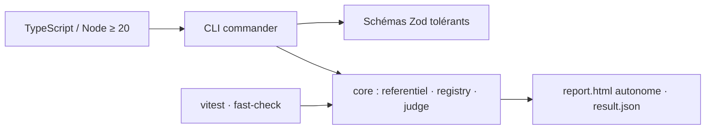
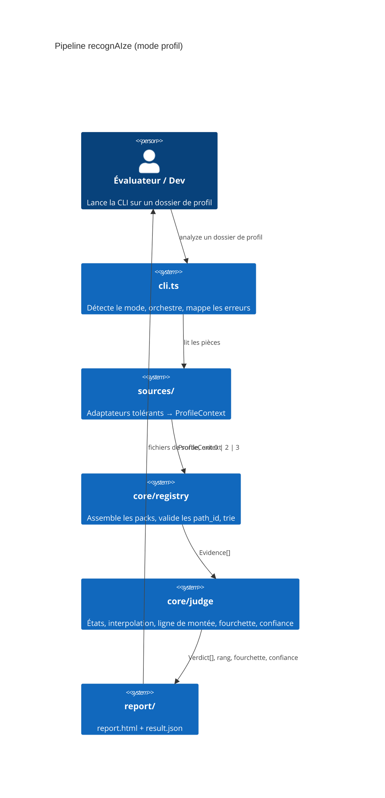
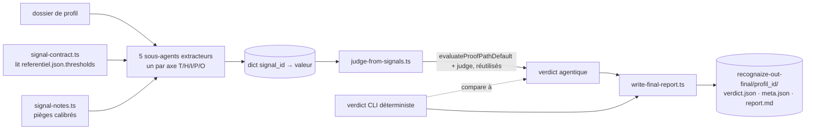

# Architecture

- [Language/Framework](#languageframework)
  - [Naming Conventions](#naming-conventions)
- [Services communication](#services-communication)
  - [Pipeline d'analyse](#pipeline-danalyse)
  - [External Services](#external-services)

> État : réel, vérifié contre le dépôt. Chemin déterministe (DEC-002) écrit,
> testé, poussé sur `feat/mvp-chemin-jury` (CI verte, 4 jambes). Un second
> chemin, agentique, coexiste pour comparaison — voir § Chemin agentique.

## Language/Framework

Manifeste à créer : `package.json` (ESM, `engines.node >= 20`, aucun script `postinstall`).

- Monolithe modulaire « B+ » : `core/` générique (référentiel, registre, juge) qui n'importe jamais un check ; `sources/` adaptateurs tolérants → `ProfileContext` ; `checks/` un fichier par (marche × source) regroupés en 5 packs importés statiquement (DEC-004 : `core-declaratif` séparé, **vide** — aucun check écrit ; le miroir déclaré/observé et les indices négatifs `confiance_source = 0` sont une logique de rendu pure dans `report/html.ts`, jamais des checks) ; `report/` rendu HTML/JSON.
- Source `SU` (« Setup ») : indice FAIBLE, jamais une
  preuve, sur `T2`/`I2` — un skill/agent spécifique du repo-context qui
  évoque explicitement une procédure orientée taille ou un cadrage
  d'autonomie. Positionnée sous `GA`/`PR`/`S` dans `referentiel.json`.`source_precedence`
  — `confiance_source = 0.3`, la plus faible source active — pour ne jamais
  écraser une preuve de comportement réellement observé. Structurellement
  NO-OP dans le CLI déterministe (`T2.setup.ts`/`I2.setup.ts`) : `RepoContextArtifact`
  ne retient pas le contenu brut des fichiers après classification — seul le
  chemin agentique peut peupler `SU.*`.
- `src/referentiel.json` = source de vérité : axes, marches, ligne de montée, source de référence par axe, seuils par `path_id` ; validé au démarrage (schéma strict).
- Un check désactivé rend ses chemins inconnus, jamais absents ; `checks/index.ts` généré (pas de découverte par glob à l'exécution) ; tri déterministe `(axe, marche, source, id)`.
- Frontières : aucune exception ne traverse une frontière — sources et checks renvoient `{ok, data} | {warning}` ; unique `try/catch` dans `cli.ts` ; exit 1 = défaut.

### Naming Conventions

- **Files**: kebab-case ; checks nommés `<marche>.<source>.ts` (ex. `T2.git-activity.ts`)
- **Functions**: camelCase
- **Variables**: camelCase
- **Constants**: UPPER_CASE
- **Types/Interfaces**: PascalCase (`Evidence`, `Verdict`, `ProfileContext`, `Check`)
- **Identifiants métier**: marches `T2`, chemins `T2.p1`, signaux `GA.size_median` (stables, utilisés par les fixtures)

## Services communication

### Pipeline d'analyse

### External Services

Aucun service externe dans le périmètre livré : pas de réseau après installation, pas de clé d'API. `git` et `gh` (mode dépôt) et l'API Anthropic (pack `experimental-llm`) sont hors périmètre de ce run.

## Chemin agentique (`scripts/agentic/`)

Second outil, comparatif, jamais un remplacement : verdict produit via des
sous-agents Claude Code (l'outil Agent de la session elle-même, jamais un
client API Anthropic provisionné séparément), pas des checks déterministes.

- `signal-contract.ts` dérive le contrat réel par axe depuis l'arbre
  `thresholds` du référentiel — jamais depuis `proof_paths[].signal_id`
  (étiquette simplifiée, peut cacher un signal composé).
- `judge-from-signals.ts` ne duplique jamais la logique de jugement : même
  `evaluateProofPathDefault`, même `judge()` que le CLI.
- `write-final-report.ts` (action 04 du skill) écrit le
  rapport final consolidé dans `recognaize-out-final/<profile_id>/` — jamais dans
  `recognaize-cli-out/`, jamais à l'intérieur du dossier de profil analysé (même
  garde-fou `resolveSubjectOutputDir` que le CLI). `profile_id` est repris tel
  quel du `result.json` déterministe, jamais recalculé, pour que les deux
  dossiers de sortie correspondent exactement pour un même run.
- Modèle/tokens/coût dans `meta.json` : le modèle est un fait connu de la
  session ; tokens et coût sont des **estimations** (règle de 3 : ~4
  caractères/token), jamais une mesure — l'outil `Agent` ne renvoie aucune
  métadonnée d'usage à l'orchestrateur (limite de plateforme vérifiée, pas un
  choix de ce projet). Toujours accompagné d'une note qui le dit.
- Aucun code de ce projet ne lit de clé API ni n'appelle l'API Anthropic
  directement (vérifié : aucun `ANTHROPIC_API_KEY`, aucune dépendance
  `@anthropic-ai/sdk`) — chaque appel LLM du skill est un appel `Agent` de
  CETTE session Claude Code.
- Calibré à un match exact sur les 5 axes des 4 étalons (perceval=red,
  bohort=blue, leodagan=green, arthur=copper), reproduit depuis un état propre.
- Formalisé en skill Claude Code : `.claude/skills/recognaize-agentic/`
  (`/recognaize-agentic <profil>` ou langage naturel).
