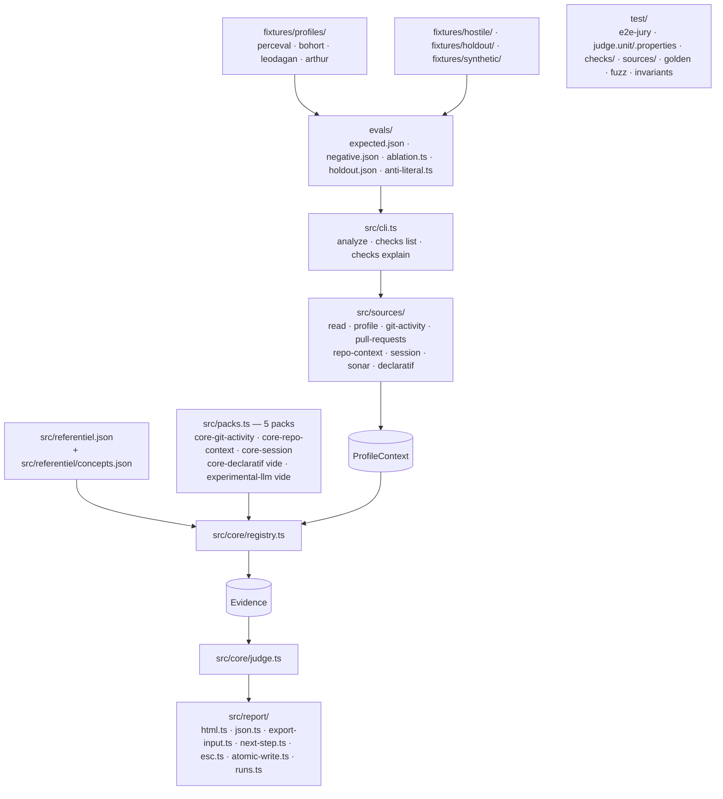

# Codebase Structure

> État : réel, vérifié contre le dépôt (`git ls-files` sur `src/`, `test/`,
> `evals/`, `scripts/`, `fixtures/`, `.claude/skills/`).

- `src/core/` : `types.ts` (vocabulaire partagé), `referentiel.ts` (chargement
  + validation Zod), `registry.ts` (assemblage des packs, tri déterministe),
  `judge.ts` (6 états, ligne de montée, fourchette, confiance, Ownership non
  bloquant), `invariants.ts`, `paths.ts`, `as-of.ts`, `errors.ts`.
- `src/sources/` : adaptateurs tolérants — `read.ts`, `profile.ts`,
  `git-activity.ts`, `pull-requests.ts`, `repo-context.ts`, `session.ts`,
  `sonar.ts`, `declaratif.ts`, `markdown-blocks.ts`, `tolerant-fields.ts`.
  Aucun `git-repo.ts` : le mode « dépôt git réel » est hors périmètre
  (`aidd_docs/features.md` § Hors périmètre).
- `src/checks/` : 48 fichiers de check répartis en `core-git-activity/`,
  `core-repo-context/`, `core-session/` ; `index.ts` généré par
  `scripts/gen-checks-index.ts` (aucun glob à l'exécution). `core-declaratif`
  et `experimental-llm` existent comme tableaux vides dans `src/packs.ts`
  (DEC-004) mais n'ont aucun fichier de check sous `src/checks/` dans ce run.
  Parmi les 48 : `T2.setup.ts`/`I2.setup.ts` (source `SU`) — NO-OP délibérés,
  jamais peuplés par le CLI déterministe (voir architecture.md § Chemin
  agentique).
- `scripts/agentic/` : `signal-contract.ts`, `signal-notes.ts`,
  `judge-from-signals.ts`, `write-final-report.ts` (écrit
  `recognaize-out-final/<profil>/{verdict.json,meta.json,report-input.json}` —
  `report.html` est ensuite rendu par `node dist/cli.js export`, jamais par ce
  script) — le second chemin vers un verdict, comparatif au chemin
  déterministe. `test/agentic/` : ses tests.
- `.claude/skills/recognaize-agentic/` : le chemin agentique formalisé en
  skill Claude Code (router + 4 actions + evals).
- `src/lib/` : fonctions pures partagées par plusieurs checks (`median-from-buckets`,
  `quality-badge`, `repo-context-signals`, `session-signals`, `size-median-signal`,
  `threshold-eval`, `coverage-non-regression`, `ai-usage-proof`,
  `context-files-signal`, `agents-md-window`).
- `src/report/` : `html.ts` (fiche autonome — accepte un `agenticContext`
  optionnel pour le chemin agentique, sans effet quand absent), `json.ts`
  (`result.json`), `export-input.ts` (schéma `--in` de la commande CLI
  `export`, voir architecture.md § Chemin agentique), `next-step.ts`, `esc.ts`
  (échappement), `atomic-write.ts`, `runs.ts`.
- Aucun `src/llm/`, aucun `cache/` : l'enrichissement LLM et le cache de rejeu
  sont hors périmètre (`aidd_docs/features.md` § Hors périmètre).
- `docs/` : `referentiel.md` (24 marches documentées), `comprendre-le-verdict.md`,
  `references/`. Documentation de pilotage (décisions, mémoire, capacités) :
  `aidd_docs/`, hors architecture produit. À la racine : `README.md`,
  `METHOD.md`, `LICENSE` (MIT).
- `fixtures/profiles/` : les 4 étalons — rang attendu documenté (MIT,
  attribution `ai-driven-dev/laivel-up`, SHA épinglé — voir
  `fixtures/profiles/ATTRIBUTION.md`) — plus `venec`/`lancelot`, deux profils
  du même dépôt source SANS rang documenté (« non donné » en amont) : jamais
  dans `evals/expected.json`, utilisés seulement en robustesse e2e
  (`test/e2e-jury.test.ts` : exit 0, `result.json` valide, aucune valeur de
  rang vérifiée). `fixtures/hostile/` :
  profil hostile (`<script>`, BOM, lien symbolique sortant). `fixtures/holdout/` :
  3 profils mutants (`arthur-plus-pr`, `bohort-sans-session`, `perceval-plus-rc`).
  `fixtures/synthetic/` : `multi-tool`, `no-ai-trace`.
- `evals/` : `expected.json` (rangs attendus), `negative.json` (fixtures
  négatives par `path_id`), `ablation.ts`, `holdout.ts`, `anti-literal.ts`,
  orchestrés par `evals/run.ts` (`npm run eval`).
- `scripts/` : `gen-checks-index.ts`, `build-assets.mjs`, `fixtures-sync.sh`,
  `fuzz-profile.ts`. Aucun script `cache-build`/`cache-check` (hors périmètre).
- `test/` : 1 test par check sous `test/checks/`, `test/sources/`, `test/core/`,
  `test/eval/`, plus `e2e-jury.test.ts`, `judge.unit.test.ts`,
  `judge.properties.test.ts`, `golden.test.ts`, `fuzz.test.ts`,
  `invariants.test.ts`, `registry.test.ts`, `referentiel.test.ts`,
  `report.*.test.ts`, `reliability-gates.test.ts` ; `test/agentic/` (pont agentique
  uniquement, jamais l'extraction LLM — pas d'oracle automatisable pour ça).
