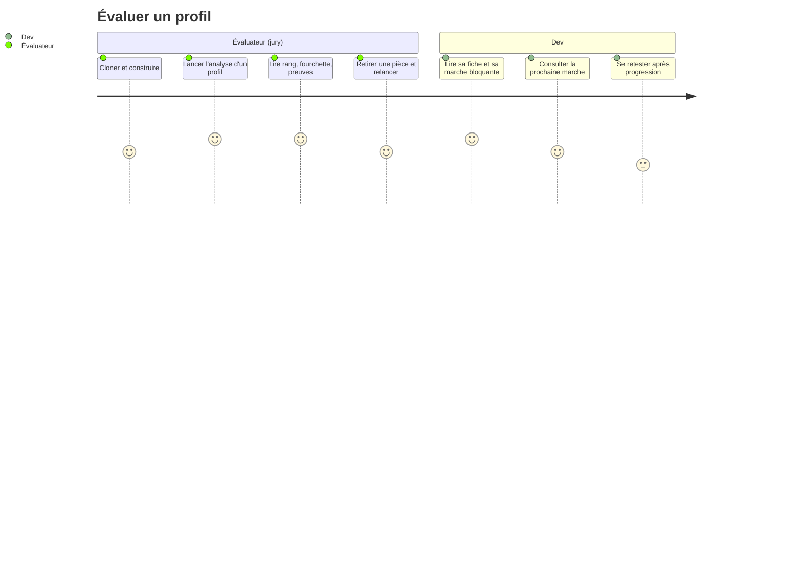

# PROJECT_BRIEF.md

recognAIze place un développeur sur son rang AI-Driven Development (White → Gold) à partir de ce qu'on sait de lui — jamais tout — et explique le verdict.

## Executive Summary

- **Project Name**: recognAIze
- **Vision**: sur des données incomplètes, celui qui gagne est celui qui dit ce qu'il sait, ce qu'il ne sait pas, et de combien il peut se tromper.
- **Mission**: un outil en ligne de commande, déterministe et sans réseau après installation, qui annonce le rang, la fourchette, la confiance, les preuves chiffrées, ce qui manque pour trancher et la prochaine marche — sans jamais échouer sur un profil incomplet.

### Full Description

Projet du hackathon laivel-up (ai-driven-dev), rendu le lundi 31 août 2026 à 12h. Le jury exécute l'outil sans clé d'API sur des profils jamais vus et note quatre critères, chacun sur cinq : ça tombe juste · on comprend pourquoi · c'est solide (ne plante pas sur un profil incomplet, assume quand il n'est pas sûr) · on peut le reprendre. Principe directeur : la fiabilité prime sur le délai (DEC-001). Le périmètre livré est le « chemin jury » (mode profil, déterministe) ; l'enrichissement par modèle de langage, l'entretien, la lecture des sessions Claude Code et le mode dépôt réel sont spécifiés mais hors périmètre de ce run.

Un second outil, agentique, coexiste (`scripts/agentic/`,
formalisé en skill `.claude/skills/recognaize-agentic/`) : même verdict visé,
via des sous-agents Claude Code plutôt que des checks déterministes, pour
comparaison — jamais un remplacement du chemin jury. Calibré à un match exact
sur les 5 axes des 4 étalons.

## Context

### Core Domain

Évaluation de l'adoption de l'IA dans le workflow d'un développeur, au sens du manifeste AI-Driven Development (Method over Model, Ownership over Delegation, Understanding over Acceptance, Outcome over Output), selon la grille officielle laivel-up : sept rangs cumulatifs sur quatre axes, plus un cinquième axe proposé (Ownership), affiché mais non bloquant.

### Ubiquitous Language

| Term | Definition | Synonymes |
| --- | --- | --- |
| Rang | Niveau de la grille : White, Red, Blue, Green, Copper, Silver, Gold | niveau (sujet) |
| Axe | Dimension mesurée : Taille, Harness, Intervention, Parallèle, Ownership | stat |
| Marche | Concept d'un axe, à apprendre et à prouver (T1…T4, H1…H7, I1…I5, P1…P3, O1…O5) | concept, rung |
| Ligne de montée | Ensemble cumulé des marches exigées pour un rang | seuils par rang |
| Chemin de preuve | Combinaison de signaux qui prouve une marche | path |
| Contre-preuve | Signal qui infirme une marche (veto) | veto |
| État d'une marche | infirmé · prouvé · indice · compris · déclaré · inconnu (ordre de priorité) ; « compris » est hors périmètre de ce run | |
| Niveau prouvé / ponctuel | Plus haute marche consécutive prouvée / prouvée-ou-indice | |
| Fourchette | [rang prouvé ; rang si les marches inconnues étaient prouvées] | |
| Confiance | Couverture des vérifications observables × accord entre sources, dans [0 ; 1] | |
| Pièce | Fichier d'un dossier de profil (profile, git-activity, pull-requests, code, sonar, repo-context, declaratif, session) | |
| Pièce porteuse | Pièce qui alimente des vérifications : git-activity, pull-requests, repo-context, session | |
| Usage IA | Preuve minimale qui sépare White de Red | |
| Indéterminé | Statut quand aucune trace ne prouve l'usage IA | |
| Harness | Ce qui entoure le modèle : contexte, comportements, guardrails, boucles | harnais |
| Étalon | Profil fourni par le sujet avec son rang attribué (perceval Red, bohort Blue, leodagan Green, arthur Copper) | fixture |
| Ablation | Retrait d'une pièce pour vérifier que le rang ne monte jamais | |
| Hold-out | Profils mutants au rang écrit avant exécution, jamais utilisés pour régler un seuil | |

## Features & Use-cases

- Analyser un dossier de profil et produire `result.json` + `report.html` (rang, fourchette, confiance, preuves, ce qui manque, prochaine marche, miroir déclaré/observé, badge qualité).
- Refuser explicitement (code 2) quand le dossier ne contient que `profile.json` ; statut « indéterminé » sans preuve d'usage IA.
- Lister et expliquer les points de vérification (`checks list`, `checks explain <marche>`).
- Vérifier la justesse et la robustesse (`npm run eval` : étalons, ablation, hold-out, fuzzer, déterminisme).

## User Journey maps

### Évaluateur (jury, CTO)

- Exécute l'outil sans clé, sur des profils incomplets et jamais vus.
- Attend un rang cohérent, une explication chiffrée, et une incertitude assumée.

### Dev

- S'auto-évalue, comprend sa marche bloquante par axe et sait quoi travailler ensuite.
- Compare ce qu'il déclare de sa pratique à ce que ses traces montrent.

### Mainteneur

- Ajoute, retire ou modifie un point de vérification sans toucher au juge ; audite les seuils dans le référentiel.
