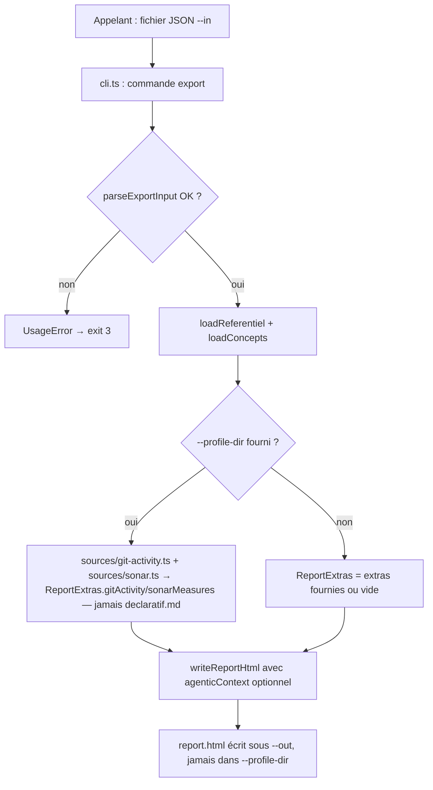
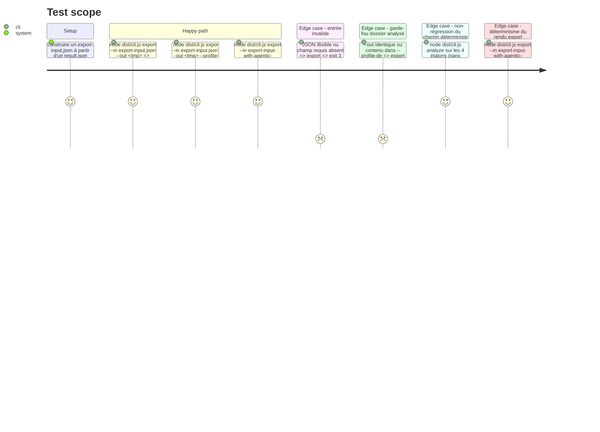

<!-- Fill or omit these sections; never add, rename, or reorder one. -->

# Instruction: Mode export CLI + section agentique dans report/html.ts

## Architecture projection

> Tree of the final files. ✅ create · ✏️ modify · ❌ delete

```txt
.
├── src/
│   ├── cli.ts                              ✏️ nouvelle commande `export` (données → report.html, sans réanalyse)
│   └── report/
│       ├── html.ts                         ✏️ paramètre optionnel `agenticContext` (banner + comparaison + delta confiance + diff incohérences), helpers purs de diff/rendu
│       └── export-input.ts                 ✅ schéma Zod tolérant + `parseExportInput` (document jugé + extras? + agentic_context?)
├── test/
│   ├── cli.export.test.ts                  ✅ e2e : entrée valide → report.html écrit ; entrée invalide → exit 3 ; `--out` dans `--profile-dir` → refusé
│   ├── report.export-input.test.ts         ✅ contract test du schéma (champ manquant, type invalide, evidence vide, JSON invalide)
│   └── report.agentic-context.test.ts      ✅ golden/unit : section absente ⇒ HTML byte-identique aux golden existants ; section présente ⇒ banner + comparaison + delta + diff rendus, aucun `undefined`/`null`/`NaN`
```

## Wireframe

<!-- UI phase only. No UI => omit the section, don't invent one. -->

> Report.html réel (`writeReportHtml`) — seules les régions (1) et (9) sont nouvelles ; (2) à (8) et (10)-(11) existent déjà et restent à l'identique, en position et en contenu.

```txt
┌──────────────────────────────────────────────────────────────────────┐
│ (1) Bandeau agentique — pleine largeur, tout en haut, avant tout      │
├─────────────────────────────────┬────────────────────────────────────┤
│ (2) En-tête verdict (existant)   │ (3) Coup d'œil (existant)          │
├─────────────────────────────────┴────────────────────────────────────┤
│ (4) « Comprendre ces chiffres » (existant)                            │
├──────────┬─────────────────────────────────────────────────────────┤
│ (5) Side │ (6) Onglets par axe (existant, inchangé)                  │
│  -bar    │                                                            │
│  glossai-│                                                            │
│  res     ├─────────────────────────────────────────────────────────┤
│          │ (7) Ce qui manque / Miroir / Qualité (existant, inchangé)  │
│          ├─────────────────────────────────────────────────────────┤
│          │ (8) Incohérences — contenu inchangé (les incohérences du   │
│          │      document rendu, agentique ou déterministe)            │
│          ├─────────────────────────────────────────────────────────┤
│          │ (9) NOUVEAU — Comparaison au chemin déterministe           │
│          │  ┌───────────────────────────────────────────────────┐   │
│          │  │ (9a) Rang par axe : Déterministe | Agentique | ✓/✗ │   │
│          │  ├───────────────────────────────────────────────────┤   │
│          │  │ (9b) Delta de confiance par axe                    │   │
│          │  ├───────────────────────────────────────────────────┤   │
│          │  │ (9c) Diff incohérences : communes / dét. seul /    │   │
│          │  │      agentique seul                                │   │
│          │  ├───────────────────────────────────────────────────┤   │
│          │  │ (9d) Exécution (estimation) : modèle, tokens, coût │   │
│          │  └───────────────────────────────────────────────────┘   │
│          ├─────────────────────────────────────────────────────────┤
│          │ (10) Annexe référentiel (existant, inchangé)              │
└──────────┴─────────────────────────────────────────────────────────┘
│ (11) Pied de page (existant, inchangé)                                │
└────────────────────────────────────────────────────────────────────┘
```

1. Bandeau : texte fixe, non ambigu — « Verdict AGENTIQUE — sous-agents LLM, comparé au chemin déterministe ci-dessous ; reproductibilité non garantie d'une exécution à l'autre (extraction, pas rendu) ». Rendu par `renderAgenticBanner`, retourne `""` si `agenticContext` absent — inséré avant `verdict-glance-row`, donc visible sans scroll.
2-8. Sections déjà existantes de `report/html.ts` (`renderHeader`, `renderGlanceSection`, `renderHeroExplainer`, l'axis switcher, `renderMissingSection`, `renderMirrorSection`, `renderQualityBadgeSection`, `renderListSection` pour les incohérences) — position et contenu strictement inchangés, `agenticContext` ne les traverse jamais.
9. Nouvelle section, seul ajout structurel de ce plan — un unique helper pur `renderAgenticComparisonSection(agenticContext)`, placé juste après (8), retourne `""` si `agenticContext` absent.
9a-9d. Sous-blocs de (9), dans cet ordre fixe — reprennent le contenu qu'affichait l'ancien `report.md` (tables « Comparaison par axe », « Confiance par axe », « Incohérences — comparaison », « Exécution »).
10-11. Existants, inchangés.

## User Journey



## Test Scope

<!-- Required for every phase. Keep Setup, Happy path, any qualifying Edge cases, and any required Teardown in this one journey. -->



## Tasks to do

### `1)` Schéma et parsing de l'entrée `export`

> Définir le format d'entrée minimal — le contenu déjà jugé, jamais les champs administratifs que la CLI sait déjà calculer.

1. Créer `src/report/export-input.ts` : type `ExportInput` = `{ document: {...contenu jugé : profile_id, status, rang_prouve, rang_ponctuel, rang_affiche, fourchette, confiance_globale, axes, ownership, verdicts, evidence, warnings, incoherences, as_of? }, extras?: ReportExtras, agentic_context?: AgenticContext }`.
2. Schéma Zod tolérant par champ (`.passthrough()` sur les objets imbriqués, jamais strict comme `referentiel.json`) ; les champs jugés obligatoires manquants ⇒ échec de parsing avec message explicite (jamais une valeur devinée).
3. `parseExportInput(raw: unknown): ExportInput` pure, aucune E/S — la lecture du fichier `--in` reste dans `cli.ts`.

### `2)` Section agentique optionnelle dans `report/html.ts`

> Un seul renderer, jamais un second — absent ⇒ zéro diff avec l'existant.

1. Exporter `AgenticContext` depuis `report/html.ts` : `{ deterministic: { rang_affiche, fourchette, confiance_globale, axes: {axe, niveau_prouve, confiance}[], incoherences }, comparison: { rows: {axe, deterministic, agentic, match}[], mismatch_notes }, execution: { model, token_estimate, cost_estimate, generated_at } }`.
2. Ajouter un 6ᵉ paramètre optionnel `agenticContext?: AgenticContext` à `buildReportHtml`/`writeReportHtml` — absent (tous les appels existants de `cli.ts`) ⇒ comportement et sortie strictement inchangés.
3. Quand présent : rendre un bandeau explicite (« Verdict AGENTIQUE — comparé au chemin déterministe, non garanti reproductible d'une exécution à l'autre »), la table de comparaison par axe, une table de delta de confiance par axe (calcul pur `agentic.confiance − deterministic.confiance`), et le diff des incohérences (commun / déterministe seul / agentique seul — helper pur `diffIncoherences`).
4. Aucune valeur `undefined`/`null`/`NaN` rendue telle quelle (même garde que le reste de `report/html.ts`).
5. **Garantie de déterminisme du rendu** (portée de cette tâche, pas du pipeline agentique complet — voir Decisions du plan) : `renderAgenticBanner`/`renderAgenticComparisonSection`/`diffIncoherences` restent des fonctions pures — aucun `Date.now()`, aucun `Math.random()`, aucun `Intl`/`toLocaleString`, aucun tri dépendant de l'ordre d'itération d'un `Object`/`Map`/`Set` non explicitement trié. `agenticContext.execution.generated_at` (s'il est fourni) est une chaîne DÉJÀ calculée par l'appelant (`meta.json`), jamais recalculée ici — le rendu se contente de l'afficher telle quelle, donc une même entrée produit toujours la même sortie, même si cette entrée contient elle-même un horodatage.

### `3)` Commande `export` dans `src/cli.ts`

> Données déjà calculées → `report.html`, jamais de réanalyse.

1. `program.command("export")` : options `--in <file>` (obligatoire), `--out <dir>` (obligatoire, pas de défaut implicite comme `analyze` — il n'y a pas de dossier de profil analysé par défaut), `--profile-dir <dir>` (optionnel).
2. Lit et parse `--in` avec `parseExportInput` ; échec ⇒ `UsageError` (exit 3).
3. Charge `referentiel`/`concepts` comme `runAnalyze` (mêmes fonctions, jamais dupliquées) ; calcule `schema_version`/`tool_version`/`referentiel_hash`/`node_version`/`pieces_et_champs_ignores` exactement comme `buildResultDocument` (réutilisés, jamais recalculés en dur).
4. Si `--profile-dir` fourni : dérive `ReportExtras.gitActivity`/`sonarMeasures` via `src/sources/git-activity.ts`/`sonar.ts` (résultat `{ok:false}` ⇒ champ omis, jamais une exception) ; ne lit jamais `declaratif.md`. Réutilise `resolveSubjectOutputDir`/une garde équivalente pour interdire un `--out` à l'intérieur de `--profile-dir`.
5. Appelle `writeReportHtml` avec le document assemblé, les extras et l'`agentic_context` éventuel — écrit uniquement `report.html` sous `--out` (jamais `result.json`, jamais l'historique de runs : ce ne sont pas des sorties de ce mode).

### `4)` Tests

1. `test/report.export-input.test.ts` : table-driven sur le schéma (champ manquant, type invalide, JSON invalide, `evidence` vide accepté).
2. `test/report.agentic-context.test.ts` : golden diff — `agenticContext` absent ⇒ HTML identique aux golden actuels des 4 étalons ; présent ⇒ bandeau/comparaison/delta/diff présents et lisibles, aucune fuite `undefined`/`null`/`NaN`.
3. `test/cli.export.test.ts` : e2e sur le binaire construit — entrée valide (avec et sans `--profile-dir`, avec et sans `agentic_context`), entrée invalide (exit 3), garde-fou `--out`/`--profile-dir` (refus).
4. **Déterminisme dédié** (`test/cli.export.test.ts`, cas nommé explicitement) : deux exécutions de `node dist/cli.js export` avec le même `--in` (avec `agentic_context`, `generated_at` inclus) produisent un `report.html` strictement identique octet pour octet — même garantie et même style de test que `test/report.snapshot.test.ts` (hostile-determinism) déjà existant pour le chemin déterministe.
5. `npm test` + `npm run lint` + `npm run typecheck` verts ; aucune régression sur les golden/snapshots existants du chemin déterministe.

## Test acceptance criteria

<!-- Each criterion is an observable behavior, not a command. -->

| Task | Acceptance criteria |
| ---- | -------------------- |
| 1... | Une entrée `--in` avec un champ jugé obligatoire manquant est rejetée avec un message explicite nommant le champ, jamais une valeur par défaut devinée. |
| 2... | `writeReportHtml` appelé sans `agenticContext` (tous les appels existants de `cli.ts analyze`) produit un `report.html` byte-identique aux golden/snapshots déjà committés. |
| 2... | `writeReportHtml` appelé avec `agenticContext` produit un HTML contenant un bandeau explicite « agentique », la table de comparaison par axe, le delta de confiance par axe et le diff des incohérences (commun/déterministe seul/agentique seul), sans aucun `undefined`/`null`/`NaN` visible. |
| 3... | `node dist/cli.js export --in <fichier valide> --out <dir>` écrit `<dir>/<profile_id>/report.html` (même convention de sous-dossier que `analyze`) et rien d'autre. |
| 3... | `node dist/cli.js export --in <fichier invalide>` sort avec le code 3, jamais 1. |
| 3... | `node dist/cli.js export --in <fichier valide> --out <dir dans --profile-dir> --profile-dir <dir>` est refusé, rien n'est écrit dans le dossier de profil. |
| 3... | `node dist/cli.js export ... --profile-dir <profil avec declaratif.md>` ne fait jamais apparaître de contenu de `declaratif.md` dans les extras dérivées. |
| 4... | Deux exécutions de `export` avec un `--in` strictement identique (bandeau/comparaison/exécution inclus) produisent un `report.html` byte-identique — aucune lecture d'horloge, d'aléatoire ou de locale dans les nouveaux renderers. |
