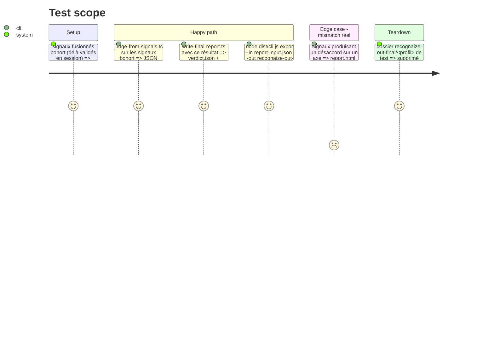

<!-- Fill or omit these sections; never add, rename, or reorder one. -->

# Instruction: Le pont agentique produit les données d'export et appelle la CLI

## Architecture projection

> Tree of the final files. ✅ create · ✏️ modify · ❌ delete

```txt
.
├── scripts/agentic/
│   ├── judge-from-signals.ts               ✏️ ajoute `evidence: Evidence[]` complet à la sortie (additif, `evidence_count` conservé)
│   └── write-final-report.ts               ✏️ n'écrit plus report.md à la main — écrit report-input.json (format ExportInput) en plus de verdict.json/meta.json inchangés
├── .claude/skills/recognaize-agentic/
│   ├── SKILL.md                            ✏️ sortie `report.md` → `report.html` (+ `report-input.json` intermédiaire)
│   └── actions/04-write-final-report.md    ✏️ nouvelle étape : appeler `node dist/cli.js export` après write-final-report.ts
└── test/agentic/
    ├── judge-from-signals.test.ts          ✏️ assertions sur le nouveau champ `evidence`
    └── write-final-report.test.ts          ✏️ nouveaux fichiers de sortie attendus, assertions "report.md" déplacées/retirées
```

## User Journey

```mermaid
flowchart TD
  A[03 judge-and-compare : signaux fusionnés] --> B[judge-from-signals.ts : result + evidence[] + evidence_count]
  B --> C[write-final-report.ts]
  C --> D[verdict.json inchangé]
  C --> E[meta.json inchangé : modèle/tokens/coût]
  C --> F[report-input.json : document jugé + agentic_context, format ExportInput]
  F --> G["node dist/cli.js export --in report-input.json --out recognaize-out-final --profile-dir <profil>"]
  G --> H[report.html — même renderer que la CLI, bandeau + comparaison inclus]
```

## Test Scope



## Tasks to do

### `1)` `judge-from-signals.ts` : exposer l'evidence complète

> Le pont produit déjà `Evidence[]` en interne (`collectEvidence`) — il ne les rendait pas visibles à l'appelant. Aucune nouvelle logique de jugement.

1. Ajouter `evidence` (le tableau déjà construit par `collectEvidence`, trié comme `sortEvidence` de `report/json.ts` — réutilisé, jamais réimplémenté) à côté de `evidence_count` dans le JSON de sortie.
2. Mettre à jour `test/agentic/judge-from-signals.test.ts` : assertions sur la présence, le tri et le contenu de `evidence`, en plus des deux régressions déjà verrouillées (T2.p2/T3.p2 jamais de contre-preuve, T4.p1 contre-preuve seulement à `xl_ratio` exactement `0`).

### `2)` `write-final-report.ts` : remplacer le Markdown fait main par un `report-input.json`

> Assemble et écrit, ne juge jamais — même contrat que documenté en tête du fichier.

1. Retirer toute génération de texte Markdown (`report.md`).
2. Construire l'objet `document` (format `ExportInput.document`, phase 1) à partir de `agentic.result` + `agentic.evidence` (nouveau champ de la tâche précédente) — profile_id et as_of repris tels quels du `result.json` déterministe (comme aujourd'hui pour `profile_id`, jamais recalculés).
3. Construire `agentic_context` à partir de `comparison` (déjà calculé par l'action 03) et de `model`/`token_estimate`/`cost_estimate` (déjà des entrées de `write-final-report.ts`) — même contenu que ce qui alimentait auparavant les sections "Confiance par axe"/"Comparaison"/"Désaccords"/"Exécution" du `report.md`, maintenant destiné au renderer HTML plutôt qu'à un gabarit Markdown.
4. Écrire `report-input.json` dans le même dossier que `verdict.json`/`meta.json` (`recognaize-out-final/<profile_id>/`) — jamais dans `recognaize-cli-out/`, jamais dans `profile_dir` (même garde `resolveSubjectOutputDir` réutilisée qu'aujourd'hui).
5. `verdict.json` et `meta.json` restent produits à l'identique (aucune régression sur leur contrat déjà testé).

### `3)` Mettre à jour le skill : appeler le mode export

> L'agent (l'orchestrateur du skill) appelle la CLI — jamais `write-final-report.ts` qui spawnerait un sous-processus lui-même (il reste un script d'assemblage pur).

1. `.claude/skills/recognaize-agentic/actions/04-write-final-report.md` : après l'étape `write-final-report.ts`, ajouter l'étape `node dist/cli.js export --in recognaize-out-final/<profile_id>/report-input.json --out recognaize-out-final --profile-dir <profile_dir>` — produit `report.html` dans le même dossier.
2. Mettre à jour la section `## Outputs` de cette action : `report.html` remplace `report.md` ; `report-input.json` est listé comme artefact intermédiaire conservé (utile pour rejouer l'export ou déboguer, jamais supprimé après coup).
3. Mettre à jour `SKILL.md` (description du dossier de sortie de l'action 04) en cohérence.
4. Mettre à jour `## Test` de `04-write-final-report.md` : la CI de calibration ("Aucun désaccord" sur `bohort`) s'observe maintenant dans `report.html` (bandeau + table de comparaison), plus dans un `report.md`.

### `4)` Tests du pont agentique

1. `test/agentic/write-final-report.test.ts` : remplacer les assertions sur le contenu Markdown de `report.md` par des assertions sur `report-input.json` (conforme au schéma de la phase 1, déterminisme déjà testé conservé — même entrée deux fois ⇒ fichiers strictement identiques hors `generated_at`).
2. Ajouter un test (ou étendre un test e2e existant) qui enchaîne `write-final-report.ts` → `node dist/cli.js export` réellement, et vérifie que `report.html` résultant contient le bandeau agentique et la comparaison — pas seulement que `report-input.json` est bien formé.

## Test acceptance criteria

| Task | Acceptance criteria |
| ---- | -------------------- |
| 1... | La sortie de `judge-from-signals.ts` contient un tableau `evidence` non vide dès qu'au moins un chemin de preuve est déterminable, trié de façon déterministe (même entrée deux fois ⇒ même ordre). |
| 2... | `recognaize-out-final/<profile_id>/` contient `verdict.json`, `meta.json` (inchangés) et `report-input.json` (nouveau, conforme au schéma `ExportInput`) — jamais `report.md`. |
| 2... | Deux exécutions de `write-final-report.ts` avec la même entrée produisent des fichiers strictement identiques hors `generated_at`. |
| 3... | En suivant `04-write-final-report.md` jusqu'au bout sur `fixtures/profiles/bohort`, `recognaize-out-final/bohort-<hash>/report.html` existe et affiche « Aucun désaccord » (accord exact des 5 axes, résultat de calibration reproduit). |
| 4... | Le test e2e du pont détecte une régression si `node dist/cli.js export` échoue sur le `report-input.json` produit par `write-final-report.ts` (les deux scripts restent compatibles au fil du temps). |
