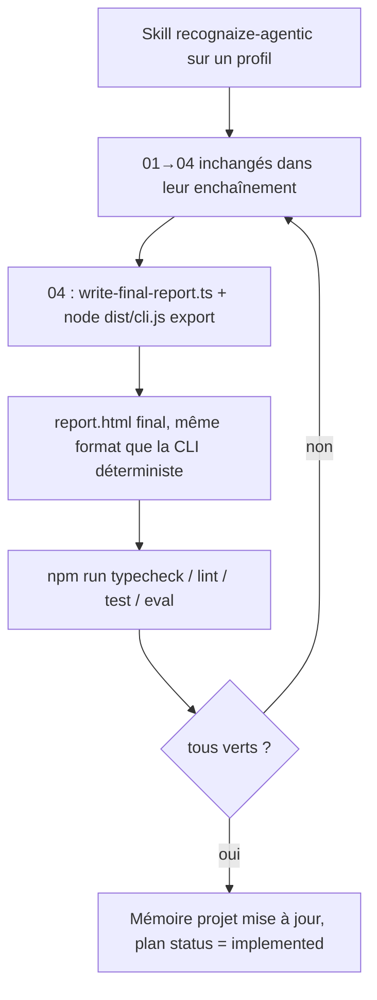
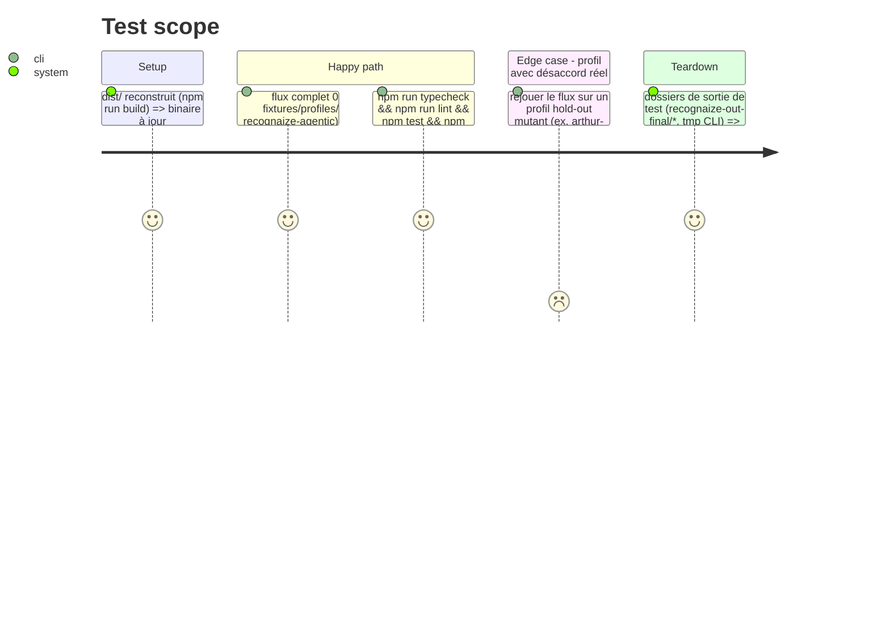

<!-- Fill or omit these sections; never add, rename, or reorder one. -->

# Instruction: Vérification bout-en-bout, mémoire projet, non-régression

## Architecture projection

> Tree of the final files. ✅ create · ✏️ modify · ❌ delete

```txt
.
├── README.md                              ✏️ mention de `report.md` du chemin agentique → `report.html`
├── aidd_docs/memory/
│   ├── architecture.md                    ✏️ § Chemin agentique : `write-final-report.ts` produit `report-input.json` + appelle `recognaize export` → `report.html`
│   └── testing.md                         ✏️ § Chemin agentique : nouveaux tests (export, agentic-context, evidence complète)
└── (aucun autre fichier — phase de vérification, pas de nouveau code)
```

## User Journey



## Test Scope



## Tasks to do

### `1)` Vérification bout-en-bout réelle

> Un agent frais à contexte vide exécute réellement le flux — jamais un auto-rapport (convention déjà en place pour ce skill).

1. Relancer `/recognaize-agentic fixtures/profiles/bohort` (ou équivalent manuel 01→04 + export) depuis un état propre.
2. Confirmer `recognaize-out-final/bohort-<hash>/report.html` : bandeau agentique visible, rang par axe identique au chemin déterministe (T2/H3/I2/P3/O3, `blue`/`blue`), "Aucun désaccord" affiché.
3. Ouvrir ce `report.html` dans un navigateur réel (serveur statique local, jamais `file://`) — DEC-005 s'applique : ce fichier est un changement de `src/report/**`/`src/cli.ts` (sortie). Vérifier l'absence de `undefined`/`null`/`NaN`, les liens internes (ancres `#concept-*`) résolvent.

### `2)` Non-régression du chemin déterministe

1. `npm run typecheck`, `npm run lint`, `npm test`, `npm run eval` — tous verts.
2. Diff explicite des golden/snapshots `report.html` des 4 étalons + profil hostile avant/après ce changement — zéro diff attendu (le paramètre `agenticContext` est optionnel et absent de tous les appels `analyze`).

### `3)` Mémoire projet

1. `aidd_docs/memory/architecture.md` § Chemin agentique : décrire le nouveau `report-input.json` + l'appel à `recognaize export`, retirer la mention de génération Markdown manuelle.
2. `aidd_docs/memory/testing.md` § Chemin agentique : lister les nouveaux tests (`test/report.export-input.test.ts`, `test/report.agentic-context.test.ts`, `test/cli.export.test.ts`, mises à jour de `judge-from-signals.test.ts`/`write-final-report.test.ts`).
3. `README.md` : corriger la mention de `report.md` du chemin agentique.

### `4)` Clôture

1. Vérifier qu'aucun `path_id` orphelin, aucun seuil en littéral n'a été introduit (les nouveaux fichiers ne touchent ni `checks/` ni `referentiel.json`).
2. Confirmer que le dossier `aidd_docs/tasks/2026_08/2026_08_31_agentic-report-html-parity/` reste la seule trace de planification (pas de document de decision supplémentaire créé ailleurs).

## Test acceptance criteria

| Task | Acceptance criteria |
| ---- | -------------------- |
| 1... | Un agent frais, en suivant uniquement `.claude/skills/recognaize-agentic/` sur `fixtures/profiles/bohort`, produit un `report.html` lisible dans un vrai navigateur, sans erreur console, sans `undefined`/`null`/`NaN` visible. |
| 2... | `npm run typecheck && npm run lint && npm test && npm run eval` sortent avec un code 0 ; les golden/snapshots `report.html` du chemin déterministe sont bit-identiques à avant ce changement. |
| 3... | `aidd_docs/memory/architecture.md`, `aidd_docs/memory/testing.md` et `README.md` ne mentionnent plus nulle part un `report.md` généré par le chemin agentique. |
| 4... | Aucun avertissement `path_id orphelin` ni seuil littéral introduit ; `git status` ne montre aucun fichier de planification hors ce dossier de feature. |
| 1... | La mémoire projet et le rapport final distinguent explicitement les deux garanties : rendu déterministe (testé, phase 1) vs pipeline agentique complet toujours non garanti déterministe d'une exécution à l'autre (limite structurelle documentée, pas une régression de ce plan). |
