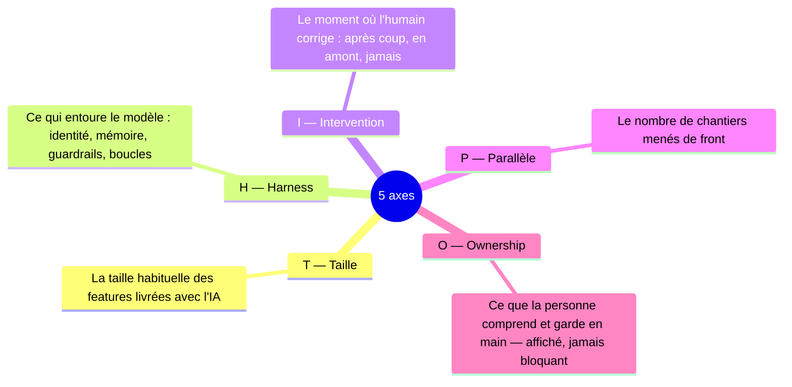
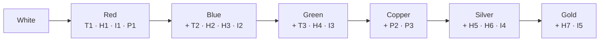
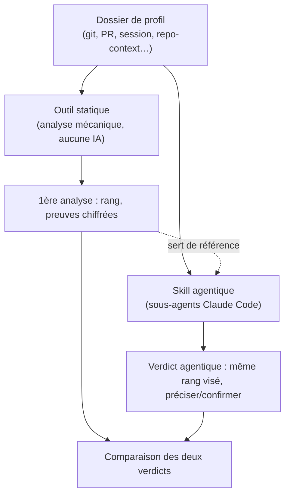
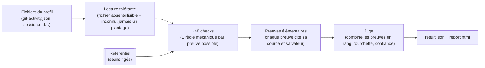
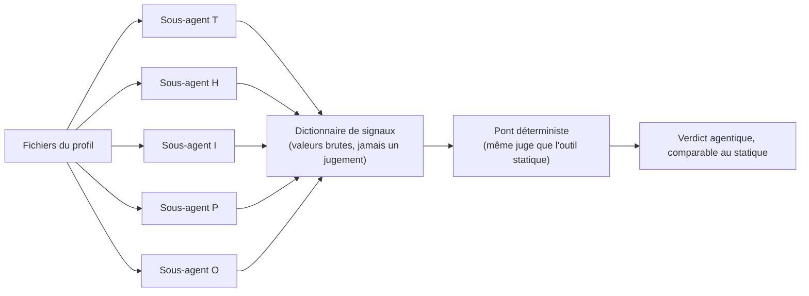

# Comprendre le verdict

> Point d'entrée en langage simple. Pour le détail exhaustif (seuils exacts,
> contre-preuves, sources) : `METHOD.md` (une page, plus technique) et
> `docs/referentiel.md` (les 24 marches, une par une). Rien ici ne remplace
> ces deux documents — ce guide sert seulement à savoir où regarder avant
> d'y aller.

## 1. Les 5 axes qu'on regarde

recognAIze ne donne jamais un rang au hasard : il regarde 5 dimensions
séparées, chacune avec ses propres paliers ("marches") à franchir.

Chaque axe a entre 3 et 7 marches, numérotées dans l'ordre (`T1`, `T2`,
`T3`… — plus le numéro est haut, plus l'axe est avancé). **Un rang de la
grille officielle (White → Gold) exige un certain niveau sur PLUSIEURS axes
à la fois** — jamais un seul axe ne suffit :

L'axe **Ownership (O)** est calculé et affiché comme les autres, mais il ne
compte jamais pour monter de rang — il peut seulement faire redescendre le
rang affiché d'un cran, si la personne comprend visiblement beaucoup moins
que ce que les 4 autres axes suggèrent.

## 2. Comment le verdict est construit — vue d'ensemble

Deux outils coexistent dans ce dépôt, jamais l'un à la place de l'autre :
un outil **statique**, qui dessine une première analyse purement mécanique,
et un **skill agentique** qui relit les mêmes données pour préciser ou
confirmer cette première analyse.

Les deux outils utilisent le **même référentiel** (les mêmes 24 marches, les
mêmes seuils) et le **même juge final** — la seule différence est COMMENT
chaque signal est extrait des données brutes du profil.

## 3. L'outil statique — comment il lit les données

Aucune intelligence artificielle ici : chaque "check" est une petite règle
mécanique, écrite à l'avance, qui va chercher une valeur précise dans un
fichier du profil et la compare à un seuil fixe.

Le point important : **une pièce absente ne fait jamais planter l'outil et
ne prouve jamais une absence de compétence** — elle rend juste les marches
concernées "inconnues". Le rang affiché vient toujours avec une fourchette
et un niveau de confiance, pour dire honnêtement ce que les données ne
permettent pas de trancher.

## 4. Le skill agentique — comment il lit les données

Plutôt que des règles mécaniques écrites à l'avance, cinq sous-agents
(un par axe) lisent les fichiers bruts du profil et essaient d'y trouver les
mêmes valeurs que l'outil statique cherche — avec la capacité de LIRE le
contenu de fichiers que l'outil statique ne fait que classer (ex. le texte
d'un skill/agent déclaré, jamais son contenu, pour l'outil statique).

Règle stricte pour chaque sous-agent : il ne renvoie **que** des valeurs
factuelles, jamais un rang, jamais une conclusion — et une valeur qu'il ne
peut pas déterminer avec certitude reste absente (jamais devinée). Le
**même** code de jugement que l'outil statique transforme ensuite ces
valeurs en verdict — aucune logique de jugement n'est jamais dupliquée entre
les deux chemins.
